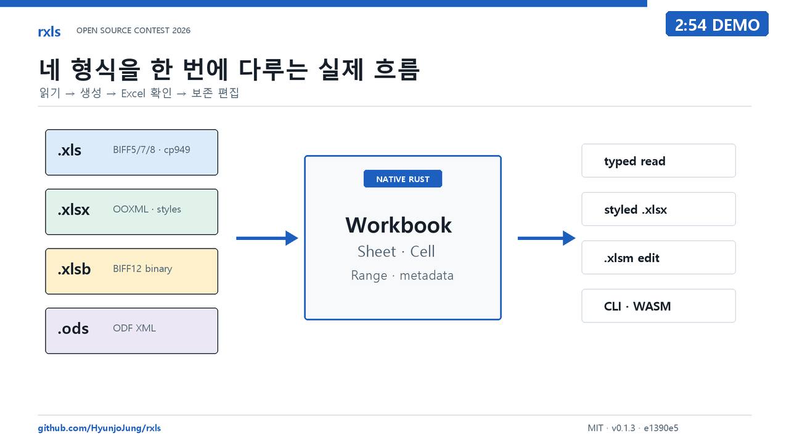
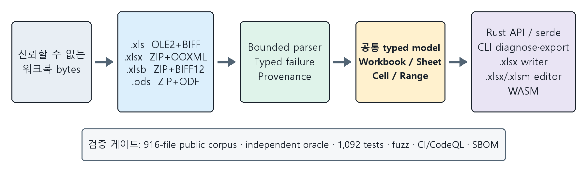

# rxls

[](README.md)
[](README.ko.md)

**네이티브 Rust 스프레드시트 툴킷.** `.xls`, `.xlsx`, `.xlsb`, `.ods`를 하나의
typed cell 모델로 읽고, 서식이 적용된 `.xlsx`를 생성하며, 패키지의 나머지
구성요소를 건드리지 않고 `.xlsx`/`.xlsm`을 편집합니다.

[](https://crates.io/crates/rxls)
[](https://docs.rs/rxls)
[](https://github.com/HyunjoJung/rxls/actions/workflows/ci.yml)
[](LICENSE)


JVM, Apache POI, Office 자동화, subprocess가 필요하지 않습니다. core library는
이들 중 어느 것도 호출하지 않습니다. 오래된 한국어 cp949 통합문서와 신뢰할 수
없는 업로드를 처리하면서도 잘못된 입력을 panic으로 바꾸지 않아야 하는 문서
파이프라인을 위해 만들었습니다.

```sh
cargo add rxls@0.1.3 --features full
```

## 핵심 기능

| 형식 | 읽기 | 쓰기 | 원본 패키지 보존 편집 | visible-value oracle |
|---|:---:|:---:|:---:|---|
| `.xls` (BIFF8/5/7) | ✓ | - | - | 414/414, `xlrd` 비교 |
| `.xlsx` | ✓ | ✓ 서식 포함 | ✓ 비수정 part 보존 | 387/387, `openpyxl` 비교 |
| `.xlsm` | ✓ | - | ✓ VBA 보존 | OOXML 행에 포함 |
| `.xlsb` | ✓ | - | - | 18/18, `pyxlsb` 비교 |
| `.ods` | ✓ | - | - | 14/14, bounded ODF XML 비교 |

다음 기능도 포함합니다.

- 결정론적 formula evaluation MVP
- CSV, HTML, Markdown 내보내기
- machine-readable workbook diagnostics
- CLI와 standalone WASM adapter
- typed row deserialization과 선택적 `chrono` 변환

### 릴리스 현황

| 릴리스 | 테스트 | 공개 corpus |
|---|---|---|
| `0.1.3` · MIT · MSRV 1.85 | 정확한 릴리스 소스에서 all-target/all-feature 테스트 1,092개 | 916개 파일 · 868개 열기 성공 · 예상된 거절 48개 · 예상 밖 결과 0개 |

[crates.io](https://crates.io/crates/rxls/0.1.3)와
[docs.rs](https://docs.rs/rxls/0.1.3/rxls/)에 게시되어 있습니다. 하나의 정확한
revision에 연결된 [52개 asset 릴리스 증거 묶음](https://github.com/HyunjoJung/rxls/releases/tag/v0.1.3)도 제공합니다.

## 데모와 아키텍처

[](https://youtu.be/_z8tUe4a1Ho)

[2분 49초 시연영상](https://youtu.be/_z8tUe4a1Ho)은 실제 `rxls` CLI로
BIFF5/cp949 통합문서를 읽고, 네 형식을 공통 모델로 열고, 서식이 적용된 운영
보고서를 만든 뒤 `openpyxl 3.1.5`로 다시 검증합니다. reader 명령은 정확한
`v0.1.3` CLI인 [`e1390e5`](https://github.com/HyunjoJung/rxls/commit/e1390e5aa349fbf933c39bccda400a4a2ee1d814)를
사용하며, 추적된 report driver도 같은 checkout의 library를 호출합니다.

[한국어 자막 파일](https://github.com/HyunjoJung/rxls/releases/download/oss-contest-2026-demo/rxls-2026-oss-contest-demo.ko.srt) ·
[빌드 영수증](https://github.com/HyunjoJung/rxls/releases/download/oss-contest-2026-demo/video-verification.json) ·
[독립 decode/audio/privacy QA](https://github.com/HyunjoJung/rxls/releases/download/oss-contest-2026-demo/video-qa.json) ·
[미디어 릴리스](https://github.com/HyunjoJung/rxls/releases/tag/oss-contest-2026-demo)



공모전 미디어 릴리스는 immutable `v0.1.3` 릴리스 증거 묶음과 의도적으로
분리되어 있습니다.

## 빠른 시작

### 읽기

검색과 인덱싱에는 plain text를, 구조 보존에는 typed cell을 사용할 수 있습니다.

```rust
let bytes = std::fs::read("book.xls")?;
let text = rxls::extract_text(&bytes)?;

let wb = rxls::Workbook::open(&bytes)?;
for sheet in &wb.sheets {
    if let Some(rxls::Cell::Date(serial)) = sheet.cell(0, 0) {
        println!("A1의 Excel date serial: {serial}");
    }
    for (row, col, cell) in sheet.cells() {
        // Cell::Text/Number/Date/Bool/Error/Formula
    }
}
```

`Workbook::open`은 container signature를 자동 판별합니다. Cargo에서 해당
기능을 켜면 같은 호출로 네 형식을 모두 처리합니다.

### `.xlsx` 생성

```rust
use rxls::{CellStyle, HAlign, Workbook};

let mut wb = Workbook::new();
let sheet = wb.add_sheet("운영보고서");

let header = CellStyle::new()
    .bold()
    .fill([0xDD, 0xEB, 0xF7])
    .align(HAlign::Center)
    .wrap();

sheet.write_styled(0, 0, "항목", &header);
sheet.write_styled(0, 1, "금액", &header);
sheet.write_url(1, 0, "https://example.com/reports/2026-07", "7월 운영 현황");
sheet.write_styled(1, 1, 150_000_000.0, &CellStyle::new().num_fmt("₩#,##0"));
sheet.set_col_width(0, 42.0);
sheet.freeze_panes(1, 0);
sheet.autofilter(0, 0, 1, 1);

std::fs::write("report.xlsx", wb.to_xlsx())?;
```

### CLI

```sh
cargo install rxls --version =0.1.3 --locked

rxls info book.xlsx
rxls diagnose book.xlsx
rxls csv book.xlsx --sheet 0 --max-output-bytes 1048576
rxls compare before.xlsx after.xlsx --limit 50
```

성공한 `--help`와 명령 출력은 stdout으로, 사용법 및 운영 오류는 stderr로
나갑니다. exit classification과 diagnose JSON schema evolution은 호환성이
관리되는 public behavior입니다.

## Cargo 기능

| 기능 | 기본값 | 제공 범위 |
|---|:---:|---|
| `cli` | 예 | `rxls` binary 빌드 |
| `xlsx` | 예 | XLSX/XLSM 읽기, XLSX 쓰기, package-preserving 편집 |
| `xlsb` | 아니요 | XLSB reader, `xlsx` package 지원 활성화 |
| `ods` | 아니요 | ODS reader |
| `serde` | 아니요 | typed row deserialization |
| `chrono` | 아니요 | date/time 및 duration 변환 |
| `full` | 아니요 | 모든 library format/data 기능, `cli`는 의도적으로 제외 |

legacy XLS reader는 항상 사용할 수 있습니다. XLS 전용 library build에는
`default-features = false`, 모든 reader와 typed-data helper에는
`features = ["full"]`을 사용합니다. 최소 지원 Rust 버전은 1.85입니다.

## 릴리스 계약

> `0.1.3`은 crate, tag source, GitHub Release bundle, SBOM, checksum,
> provenance가 release manifest를 통해 하나의 정확한 revision에 연결될 때만
> 승인됩니다.

`v0.1.3` tag와 게시된 package는 immutable입니다. 이후 `main`에는 문서나
미출시 작업이 포함될 수 있습니다. 릴리스 계약을 평가할 때는 versioned package를
사용하고, `main`을 평가할 때는 checkout source를 직접 빌드하십시오.

prepublication과 postpublication gate는 reader와 formula 정확성,
package-preserving XLSX/XLSM 편집, CLI, JSON, core WASM, 공개 corpus parity,
security analysis, fuzzing, performance budget, SBOM/provenance, exact-package
installation을 검증합니다.

## 공개 corpus 증거

2026-08-22에 고정된 recipe는 Apache POI와 calamine의 immutable upstream
commit에서 916개 파일을 선택합니다.

| 형식 | 전체 | 독립 비교 결과 |
|---|---:|---|
| `.xls` | 448 | 비교 가능 414개 모두 99% 이상, 평균 100% |
| `.xlsx`/`.xlsm` | 431 | 비교 가능 387개 모두 99% 이상, 평균 100% |
| `.xlsb` | 21 | 비교 가능 18개, 평균 100% |
| `.ods` | 16 | 비교 가능 14개, 평균 recall 100% |

`rxls corpus-report`는 868개를 열었습니다. 나머지 48개는 encrypted input,
지원하지 않는 legacy BIFF, malformed container, structurally invalid BIFF
stream, malformed OOXML relationship으로 명시된 예상 거절입니다. 예상 밖 실패와
예상 밖 수용은 모두 0건입니다.

릴리스 주장은 공개되고 재현 가능한 fixture와 corpus에만 의존합니다. 자세한
baseline, oracle version, input manifest SHA-256은 [영문 README](README.md)의
Public corpus evidence 절을 참고하십시오.

## 안전성과 설계 원칙

- 확장자가 아니라 OLE2/ZIP 등 container signature로 형식을 판별합니다.
- input, allocation, recursion, output 크기에 상한을 둡니다.
- `FILEPASS` 암호화 문서는 ciphertext를 내보내지 않고 `Error::Encrypted`로
  거절합니다.
- malformed structure는 명시적인 bounded recovery 또는 typed error로 처리합니다.
- macro와 external link를 실행하지 않습니다.
- `#![forbid(unsafe_code)]`, CodeQL, dependency policy, fuzz gate를 적용합니다.
- tolerant recovery는 audit signal이며 원본 container의 완전성을 보장하지 않습니다.

## 지원 범위

### 읽기

날짜, 시간, percentage는 유지된 format metadata를 사용해 표시합니다. custom
format은 section, condition, color, locale/currency marker, grouping/scaling,
fraction, scientific notation, elapsed token, literal, escape, text placeholder를
지원합니다. formula 재평가는 결정론적 MVP로 제한되며, 범위 밖 formula는
`FormulaUnsupportedReason`을 반환하고 값을 추측하지 않습니다.

### 기존 파일 편집

`.xlsx`와 `.xlsm`만 package-preserving 방식으로 편집합니다. atomic batch,
cell/formula/range 수정, document/name/sheet/layout/pane/print-area metadata,
sheet add/rename/delete, merge, legacy note, hyperlink, exact-range validation,
기존 table의 안전한 bottom-row resize를 지원합니다. 수정하지 않은 declared part와
VBA content는 byte-for-byte로 보존합니다.

행이나 열의 삽입·삭제는 지원하지 않으며, 안전하지 않은 structural dependency를
추측하여 복구하지 않습니다.

### `.xlsx` authoring

font, fill, border, number format, alignment, merge, width/height, frozen pane,
autofilter, hyperlink, page setup, protection, tab color, data validation,
conditional formatting, PNG/JPEG image, chart, sparkline, worksheet table,
rich string, legacy comment/note를 지원합니다. pivot table, threaded comment,
macro 생성은 범위 밖입니다.

### Export, diagnostics, WASM

worksheet는 CSV, HTML, Markdown로 내보낼 수 있습니다. `WorkbookReport`와
`rxls diagnose`는 sheet/cell/formula count, document property, feature inventory,
parse provenance를 JSON으로 제공합니다. `bindings/wasm`은 Node/browser entry,
TypeScript declaration, structured `RxlsError`, 32 MiB input limit을 제공합니다.

## 재현

아래 명령은 private data 없이 clean checkout에서 실행됩니다.

```bash
python3 -m pip install \
  "CairoSVG==2.9.0" "numpy==2.4.4" "openpyxl==3.1.5" \
  "Pillow==12.3.0" "pyxlsb==1.0.10" "xlrd==2.0.2" "odfpy==1.4.1"
python3 scripts/public_hygiene_audit.py
cargo fmt --all -- --check
cargo clippy --all-targets --all-features --locked -- -D warnings
RXLS_REQUIRE_OPENPYXL=1 cargo test --all-targets --all-features --locked
cargo test --no-default-features --all-targets --locked
cargo test --doc --all-features --locked
RUSTDOCFLAGS="-D warnings" cargo doc --no-deps --all-features --locked
python3 -m unittest discover -s scripts -p "test_*.py"
cargo package --locked
cargo publish --dry-run --locked
```

전체 916개 공개 corpus 실행 명령과 deterministic release workflow는
[영문 README](README.md#reproduce)에 유지합니다.

## 실험적 rendering workspace

renderer와 `@rxls/render-worker`는 게시된 `rxls 0.1.3` core 계약에 포함되지
않는 별도 source-only track입니다. core crate의 reader/writer/CLI/WASM 릴리스
주장과 구분합니다. 빌드, 제한, font isolation, pagination, distribution gate는
[renderer guide](render/README.md)와
[worker package guide](bindings/render-wasm/README.md)를 참고하십시오.

## 기여

Issue와 pull request를 환영합니다. [CONTRIBUTING.md](CONTRIBUTING.md)는
public item 문서화, 최소 dependency, specification citation, bounded processing,
PR 전 local gate를 설명합니다. [Code of Conduct](.github/CODE_OF_CONDUCT.md)와
[Security Policy](.github/SECURITY.md)도 함께 적용됩니다.

## 라이선스

[MIT License](LICENSE)로 배포합니다. third-party dependency license는
[THIRD_PARTY_LICENSES.md](THIRD_PARTY_LICENSES.md)에 정리되어 있습니다.
공개된 [MS-XLS], [MS-XLSB], [MS-CFB], [ECMA-376], [ODF] specification만
구현하며 Microsoft source를 포함하지 않습니다.

Microsoft와 Excel은 Microsoft group of companies의 상표입니다. 이 프로젝트는
Microsoft와 제휴하거나 Microsoft의 승인·후원을 받지 않았습니다.

[MS-XLS]: https://learn.microsoft.com/en-us/openspecs/office_file_formats/ms-xls/
[MS-XLSB]: https://learn.microsoft.com/en-us/openspecs/office_file_formats/ms-xlsb/
[MS-CFB]: https://learn.microsoft.com/en-us/openspecs/windows_protocols/ms-cfb/
[ECMA-376]: https://ecma-international.org/publications-and-standards/standards/ecma-376/
[ODF]: https://docs.oasis-open.org/office/OpenDocument/v1.3/
