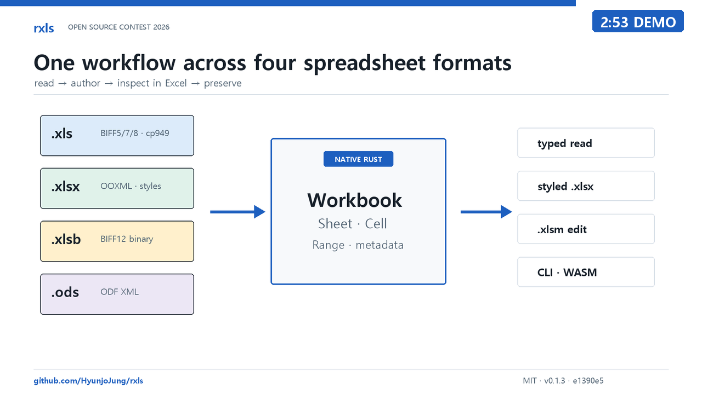

# rxls

[English](README.md) | **한국어**

**오래된 형식부터 최신 형식까지 다루는 하나의 Rust 네이티브 스프레드시트
툴킷.**

XLS, XLSX, XLSB, ODS를 하나의 타입 모델로 읽습니다. XLSX를 새로 만들고,
수정하지 않은 패키지 파트는 그대로 보존하면서 XLSX/XLSM을 편집합니다.

[](https://crates.io/crates/rxls)
[](https://docs.rs/rxls)
[](https://hyunjojung.github.io/rxls/)
[](https://github.com/HyunjoJung/rxls/actions/workflows/ci.yml)
[](LICENSE)


업무에서는 서로 다른 시기와 프로그램에서 만들어진 엑셀 문서를 한꺼번에
마주하게 됩니다. `rxls`는 JVM이나 Apache POI, Office 설치, 별도 프로세스 없이
이 파일들을 Rust 프로그램 안에서 처리합니다. 잘못되거나 지원하지 않는 입력은
panic 대신 처리 범위가 제한된 타입 오류로 반환합니다.

```sh
cargo add rxls@0.1.3 --features full
```

## rxls를 쓰는 이유

- **하나의 읽기 모델.** `Workbook::open` 한 번으로 XLS, XLSX, XLSB, ODS를
  판별하고 같은 `Cell`, 시트, 범위, 메타데이터, 내보내기 API로 다룹니다.
- **Rust 네이티브.** BIFF 형식과 오래된 한국어 cp949 통합문서도 Java 런타임,
  Office 자동화, 보조 실행 파일 없이 프로세스 안에서 읽습니다.
- **보존을 전제로 한 편집.** `Spreadsheet`는 지원하는 XLSX/XLSM 구조만
  수정하고, VBA를 포함한 나머지 선언된 패키지 파트는 바이트 단위로 보존합니다.

## 형식 지원

| 형식 | 읽기 | 새로 만들기 | 원본 보존 편집 | 공개 표시 값 검증 |
|---|:---:|:---:|:---:|---|
| `.xls` (BIFF8/5/7) | 지원 | 미지원 | 미지원 | 414/414, `xlrd` 비교 |
| `.xlsx` | 지원 | 서식 포함 XLSX | 지원 | 387/387, `openpyxl` 비교 |
| `.xlsm` | 지원 | 미지원 | VBA를 보존하며 지원 | OOXML 결과에 포함 |
| `.xlsb` | 지원 | 미지원 | 미지원 | 18/18, `pyxlsb` 비교 |
| `.ods` | 지원 | 미지원 | 미지원 | 14/14, 범위를 제한한 ODF XML 비교 |

네 가지 형식을 모두 읽으려면 `features = ["full"]`을 사용합니다. XLS 리더는
항상 포함되고 XLSX/XLSM은 기본 기능으로 활성화됩니다. 형식, 메타데이터,
Cargo 기능, CLI, 내보내기, WASM, 로컬 MCP의 정확한 범위는
[Compatibility 문서](docs/compatibility.md)에서 확인할 수 있습니다. (English)

### 공통 읽기 인터페이스

원본 형식에 따라 파서는 달라지지만 애플리케이션이 사용하는 모델은 같습니다.

| 필요한 작업 | API |
|---|---|
| 검색 가능한 텍스트 | `extract_text`, `Workbook::to_text` |
| 타입 셀과 좌표 | `Sheet::cell`, `cells`, `dimensions` |
| 직사각형 데이터 | `worksheet_range`, 행 보기, 상대·절대 used cell |
| 통합문서 구조 | 시트 표시 상태, 이름, 속성, 표, 틀, 인쇄 설정 |
| 문서 기능 | 가능한 형식의 수식, 링크, 메모, 유효성 검사, 차트, 이미지 |
| 타입 데이터 수집 | 선택적 `serde` 행과 `chrono` 날짜·시간 변환 |

리더는 날짜, 시간, 백분율, 사용자 지정 표시를 위한 숫자 서식 메타데이터를
유지합니다. 수식 셀은 복구할 수 있는 원문과 문서를 만든 프로그램이 저장한 캐시
값을 함께 보존합니다. 코드페이지 선언이 없거나 잘못된 레거시 문서는
`Workbook::open_with_codepage`로 디코딩 방식을 지정할 수 있습니다.

## 빠른 시작

### XLS, XLSX, XLSB, ODS 읽기

```rust
let bytes = std::fs::read("book.xls")?;

// 검색과 인덱싱에 사용할 일반 텍스트
let text = rxls::extract_text(&bytes)?;
println!("{text}");

// 구조를 유지한 타입 셀
let workbook = rxls::Workbook::open(&bytes)?;
for sheet in &workbook.sheets {
    for (_row, _col, cell) in sheet.cells() {
        match cell {
            rxls::Cell::Text(value) => println!("{value}"),
            rxls::Cell::Number(value) => println!("{value}"),
            _ => {}
        }
    }
}
```

`Workbook::open`은 확장자가 아니라 파일 바이트의 컨테이너를 판별합니다. 해당
Cargo 기능이 켜져 있으면 네 가지 읽기 형식에 같은 호출을 사용합니다.

### 서식이 있는 XLSX 만들기

```rust
use rxls::{CellStyle, HAlign, Workbook};

let mut workbook = Workbook::new();
let sheet = workbook.add_sheet("운영 보고서");
let header = CellStyle::new()
    .bold()
    .fill([0xDD, 0xEB, 0xF7])
    .align(HAlign::Center)
    .wrap();

sheet.write_styled(0, 0, "항목", &header);
sheet.write_styled(0, 1, "금액", &header);
sheet.write_url(1, 0, "https://example.com/report", "7월 운영 현황");
sheet.write_styled(1, 1, 150_000_000.0, &CellStyle::new().num_fmt("₩#,##0"));
sheet.set_col_width(0, 42.0);
sheet.freeze_panes(1, 0);
sheet.autofilter(0, 0, 1, 1);

std::fs::write("report.xlsx", workbook.to_xlsx())?;
```

### 기존 XLSX 또는 XLSM 편집

```rust
use rxls::{Cell, Spreadsheet};

let bytes = std::fs::read("book.xlsx")?;
let mut spreadsheet = Spreadsheet::open(&bytes)?;
spreadsheet.set_cell_value(
    "Data",
    0,
    0,
    Cell::Text("rxls에서 수정".into()),
)?;
std::fs::write("book-edited.xlsx", spreadsheet.save()?)?;
```

XLSM도 입력과 출력 확장자를 XLSM으로 유지하면 같은 흐름으로 VBA 프로젝트를
보존합니다. 불완전하거나 패키지 메타데이터가 손실된 OOXML 파일은 읽을 수
있더라도 보존 계약을 지킬 수 없는 편집은 거절합니다.

## 원본 보존 편집

패키지 구조를 보존하는 편집 범위는 읽기 범위보다 의도적으로 좁습니다.
XLSX/XLSM의 셀·수식·범위, 문서와 시트 메타데이터, 시트 추가·이름 변경·삭제,
레이아웃과 틀, 인쇄 영역, 병합, 레거시 메모, 하이퍼링크, 정확한 범위의 데이터
유효성 검사, 기존 표의 마지막 행 조정을 지원합니다.

모든 변경은 패키지를 수정하기 전에 편집 가능 여부부터 확인합니다.
`Spreadsheet::transaction`은 복제본에 일괄 변경을 적용한 뒤 직렬화까지
성공했을 때만 반영합니다. 실패하면 통합문서, 원본 패키지 바이트,
`edited_parts()`가 모두 이전 상태로 남습니다.

행이나 열의 삽입·삭제는 지원하지 않으며, 안전하지 않은 구조적 의존성을 추측해
복구하지 않습니다. 전체 계약은
[Preservation and editing](docs/preservation.md)에 정리했습니다. (English)

## 검증

<!-- public-corpus-summary:ko:start -->
**공개 코퍼스(2026-08-22):** 916개 파일 중 868개를 열었고 48개는 예상된
거절이었습니다. 예상 밖 실패는 0건, 예상 밖 수용은 0건입니다. 표시 값 검증은
비교 가능한 `.xls` 414개, `.xlsx`/`.xlsm` 387개, `.xlsb` 18개,
`.ods` 14개에서 평균 일치율 또는 재현율 100.000%를 기록했습니다.
<!-- public-corpus-summary:ko:end -->

| 릴리스 | 테스트 | 배포 |
|---|---|---|
| `0.1.3` · MIT · MSRV 1.85 | 릴리스와 같은 소스에서 all-target/all-feature 테스트 1,092개 | [crates.io](https://crates.io/crates/rxls/0.1.3) · [docs.rs](https://docs.rs/rxls/0.1.3/rxls/) · [GitHub Release](https://github.com/HyunjoJung/rxls/releases/tag/v0.1.3) |

모든 수치는 공개되어 있고 재현 가능한 픽스처와 코퍼스에서 나옵니다. Oracle
버전, input manifest 해시, 예상 거절 분류, 전체 재현 명령, 릴리스 provenance,
별도로 관리되는 렌더링 증거는
[Validation and reproducibility](docs/validation.md)에 있습니다. (English)

## 데모와 아키텍처

### 브라우저 뷰어

[rxls 라이브 뷰어](https://hyunjojung.github.io/rxls/)에서는 별도 설치 없이 XLS,
XLSX, XLSM, XLSB, ODS 파일을 확인할 수 있습니다. 선택한 파일은 업로드하지 않고
브라우저의 처리 범위가 제한된 WebAssembly worker 안에서 처리합니다. 프로젝트가
직접 만든 샘플, 시트·페이지 보기, 확대·축소, SVG/PNG 내보내기를 제공합니다.
보존 조건을 충족하는 XLSX/XLSM에서는 타입이 있는 셀 값, 수식, 문서 속성을
편집하고 실행 취소·다시 실행한 뒤 새 통합문서로 내려받을 수 있습니다. 이때
VBA를 포함한 손대지 않은 패키지 파트는 그대로 보존합니다. XLS, XLSB, ODS는
명시적으로 읽기 전용입니다.

### 시연 영상

| 한국어 시연 | 영어 시연 |
|---|---|
| [](https://youtu.be/IzmFd_ARh1A) | [](https://youtu.be/Z7tNhqMdCVU) |
| [2분 54초 한국어 시연 보기](https://youtu.be/IzmFd_ARh1A) | [2분 53초 영어 시연 보기](https://youtu.be/Z7tNhqMdCVU) |

영상에서는 실제 `v0.1.3` CLI로 BIFF5/cp949 통합문서와 네 가지 읽기 형식을
처리합니다. 이어서 서식이 적용된 XLSX 보고서를 만들고 Excel 16에서 확인한 뒤
`openpyxl 3.1.5`로 다시 엽니다.


형식별 파싱 결과는 하나의 타입 통합문서 모델로 모입니다. 라이브러리, CLI,
내보내기, 진단, 편집, WASM, 로컬 MCP 인터페이스가 이 모델을 함께 사용합니다. 구현
경계는 [Format internals](docs/format-internals.md)를 참고하십시오. (English)

## 문서

| 문서 | 내용 |
|---|---|
| [Compatibility](docs/compatibility.md) | 형식, Cargo 기능, 메타데이터, 내보내기, CLI, WASM, 로컬 MCP 지원 범위 |
| [Preservation and editing](docs/preservation.md) | XLSX/XLSM 편집 가능 여부, atomicity, 보존 파트, 명시적 비지원 범위 |
| [Validation and reproducibility](docs/validation.md) | 공개 코퍼스, oracle, 릴리스 증거, 재현 명령 |
| [Format internals](docs/format-internals.md) | BIFF, 코드페이지, OOXML/ODS 파싱, 입력 한도와 실패 동작 |
| [Formula support](docs/formulas.md) | 캐시된 수식, 결정론적 평가, 타입 fallback 사유 |

위 상세 문서는 영문 단일 원본입니다. Rust API 문서는
[docs.rs](https://docs.rs/rxls), 릴리스별 변경 내용은
[CHANGELOG.md](CHANGELOG.md)에서 확인할 수 있습니다.

## 기능과 현재 상태

| Cargo 기능 | 기본값 | 제공 범위 |
|---|:---:|---|
| `cli` | 예 | `rxls` 바이너리 |
| `xlsx` | 예 | XLSX/XLSM 읽기, XLSX 생성, 패키지 보존 편집 |
| `xlsb` | 아니요 | XLSB 리더와 XLSX 패키지 지원 |
| `ods` | 아니요 | ODS 리더 |
| `serde` | 아니요 | 타입 기반 행 역직렬화 |
| `chrono` | 아니요 | 날짜·시간과 duration 변환 |
| `full` | 아니요 | 모든 라이브러리 형식·타입 데이터 기능, `cli` 제외 |

### 내장 인터페이스

- **리더 메타데이터:** 형식에서 제공하는 이름, 문서 속성, 시트 표시 상태,
  하이퍼링크, 메모, 유효성 검사, 표, 틀, 필터, 인쇄 설정, 차트, 이미지를 공통
  타입 접근자로 확인합니다.
- **XLSX 생성:** 글꼴, 채우기, 테두리, 숫자 서식, 정렬, 병합, 틀, 필터,
  페이지 설정, 보호, 유효성 검사, 조건부 서식, 이미지, 차트, 스파크라인, 표,
  서식 있는 문자열, 메모를 지원합니다.
- **수식 처리:** 원문과 캐시 값을 보존합니다. 처리 범위가 제한된 평가기는
  문서화된 결정론적 일부만 계산하고, 나머지는 캐시 값과 타입이 있는
  `FormulaUnsupportedReason`을 반환합니다.
- **내보내기와 진단:** CSV, HTML, Markdown 출력과 함께 시트·셀·수식 수,
  문서 속성, 기능 목록, parse provenance를 담은 `WorkbookReport` JSON을
  제공합니다.
- **이식 가능한 인터페이스:** 네이티브 CLI, 분리된 Node/브라우저 WASM
  어댑터, 로컬 stdio MCP 서버가 같은 코어 모델을 사용합니다. MCP 세션은
  허용 경로 안에서만 동작하고 구조화 결과를 반환하며 XLSX/XLSM 패키지를
  보존합니다. 워크북 바이트는 프로토콜 메시지나 네트워크로 나가지 않습니다.

```sh
cargo install rxls --version =0.1.3 --locked
rxls info book.xlsx
rxls diagnose book.xlsx
rxls csv book.xlsx --sheet 0 --max-output-bytes 1048576
```

소스 워크스페이스에는 아직 별도 배포하지 않은 로컬 MCP 서버도 있습니다.

```sh
cargo build --release --manifest-path bindings/mcp/Cargo.toml --locked
bindings/mcp/target/release/rxls-mcp --root /path/to/spreadsheets
```

9개 도구, 클라이언트 설정, 파일시스템 경계, 자원 제한은
[MCP 서버 가이드(English)](bindings/mcp/README.md)에 정리되어 있습니다.

현재 게시된 코어 릴리스는 `0.1.3`입니다. 렌더러,
`@rxls/render-worker`, 로컬 MCP 서버는 별도 게이트로 관리되는 워크스페이스
인터페이스이며 게시된 코어 크레이트 계약에는 포함되지 않습니다.

## 기여

이슈와 pull request를 환영합니다. [CONTRIBUTING.md](CONTRIBUTING.md)는 로컬
검증 절차, 공개 API 요구사항, 입력 범위 제한 정책, 사양 인용 규칙을 설명합니다.
[Code of Conduct](.github/CODE_OF_CONDUCT.md)와
[Security Policy](.github/SECURITY.md)도 함께 적용됩니다.

## 라이선스

[MIT License](LICENSE)로 배포합니다. 서드파티 의존성 라이선스는
[THIRD_PARTY_LICENSES.md](THIRD_PARTY_LICENSES.md)에 정리했습니다. 공개된
[MS-XLS], [MS-XLSB], [MS-CFB], [ECMA-376], [ODF] 사양만 구현하며 Microsoft
소스를 포함하지 않습니다.

Microsoft와 Excel은 Microsoft 그룹사의 상표입니다. 이 프로젝트는 Microsoft와
제휴 관계가 없으며 Microsoft의 승인이나 후원을 받지 않습니다.

[MS-XLS]: https://learn.microsoft.com/en-us/openspecs/office_file_formats/ms-xls/
[MS-XLSB]: https://learn.microsoft.com/en-us/openspecs/office_file_formats/ms-xlsb/
[MS-CFB]: https://learn.microsoft.com/en-us/openspecs/windows_protocols/ms-cfb/
[ECMA-376]: https://ecma-international.org/publications-and-standards/standards/ecma-376/
[ODF]: https://docs.oasis-open.org/office/OpenDocument/v1.3/
