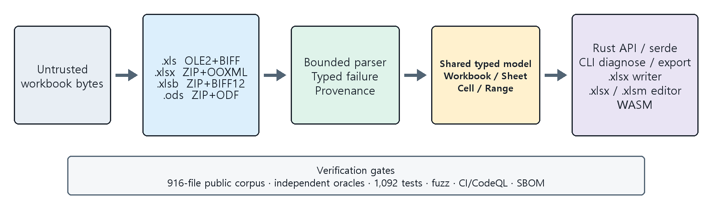

# rxls

**English** | [한국어](README.ko.md)

**One native Rust toolkit for legacy and modern spreadsheet files.**

Read XLS, XLSX, XLSB, and ODS through one typed model. Create XLSX and modify
XLSX/XLSM while preserving untouched package parts.

[](https://crates.io/crates/rxls)
[](https://docs.rs/rxls)
[](https://hyunjojung.github.io/rxls/)
[](https://github.com/HyunjoJung/rxls/actions/workflows/ci.yml)
[](LICENSE)


`rxls` is built for applications that encounter spreadsheet files from
different eras and tools. The core library requires no JVM or Apache POI,
performs no Office automation, and spawns no subprocesses. Its parsers use
bounded inputs and typed failures for malformed or unsupported documents.

```sh
cargo add rxls@0.1.3 --features full
```

## Why rxls

- **One read model.** `Workbook::open` detects XLS, XLSX, XLSB, or ODS and
  exposes the same typed `Cell`, sheet, range, metadata, and export surfaces.
- **Native Rust.** Legacy BIFF and Korean cp949 workbooks are handled in-process
  without a Java runtime, Office installation, or helper executable.
- **Preservation-aware editing.** `Spreadsheet` modifies supported XLSX/XLSM
  structures while retaining untouched declared package parts byte-for-byte,
  including VBA content.

## Format support

| Format | Read | Create | Preserve and edit | Public visible-value check |
|---|:---:|:---:|:---:|---|
| `.xls` (BIFF8/5/7) | Yes | No | No | 414/414 vs `xlrd` |
| `.xlsx` | Yes | Styled XLSX | Yes | 387/387 vs `openpyxl` |
| `.xlsm` | Yes | No | Yes, including retained VBA | Included in the OOXML result |
| `.xlsb` | Yes | No | No | 18/18 vs `pyxlsb` |
| `.ods` | Yes | No | No | 14/14 vs bounded ODF XML |

Reading all four formats requires `features = ["full"]`. XLS is always
available; XLSX/XLSM is enabled by default. See
[Compatibility](docs/compatibility.md) for the exact format, metadata, feature,
CLI, export, and WASM boundaries.

### Common read surfaces

The source format changes the parser, not the application-facing model:

| Need | API |
|---|---|
| Searchable text | `extract_text`, `Workbook::to_text` |
| Typed coordinates | `Sheet::cell`, `cells`, `dimensions` |
| Rectangular data | `worksheet_range`, row views, relative and absolute used cells |
| Workbook structure | sheet visibility, names, properties, tables, panes, print setup |
| Embedded features | formulas, hyperlinks, comments, validation, charts, and images where available |
| Typed ingestion | optional `serde` rows and `chrono` date/time conversions |

The readers retain number-format metadata for dates, times, percentages, and
custom display formats. Formula cells keep both recoverable source text and the
cached value supplied by the producing application. Legacy workbooks with a
missing or incorrect codepage can use `Workbook::open_with_codepage`.

## Quick start

### Read XLS, XLSX, XLSB, or ODS

```rust
let bytes = std::fs::read("book.xls")?;

// Plain text for search and indexing.
let text = rxls::extract_text(&bytes)?;
println!("{text}");

// Typed cells for structured processing.
let workbook = rxls::Workbook::open(&bytes)?;
for sheet in &workbook.sheets {
    for (_row, _col, cell) in sheet.cells() {
        match cell {
            rxls::Cell::Text(value) => println!("{value}"),
            rxls::Cell::Number(value) => println!("{value}"),
            _ => {}
        }
    }
}
```

`Workbook::open` detects the container from its bytes. The same call works for
every enabled read format.

### Create a styled XLSX

```rust
use rxls::{CellStyle, HAlign, Workbook};

let mut workbook = Workbook::new();
let sheet = workbook.add_sheet("Operations Report");
let header = CellStyle::new()
    .bold()
    .fill([0xDD, 0xEB, 0xF7])
    .align(HAlign::Center)
    .wrap();

sheet.write_styled(0, 0, "Item", &header);
sheet.write_styled(0, 1, "Amount", &header);
sheet.write_url(1, 0, "https://example.com/report", "July operations");
sheet.write_styled(1, 1, 150_000_000.0, &CellStyle::new().num_fmt("$#,##0"));
sheet.set_col_width(0, 42.0);
sheet.freeze_panes(1, 0);
sheet.autofilter(0, 0, 1, 1);

std::fs::write("report.xlsx", workbook.to_xlsx())?;
```

### Edit an existing XLSX or XLSM

```rust
use rxls::{Cell, Spreadsheet};

let bytes = std::fs::read("book.xlsx")?;
let mut spreadsheet = Spreadsheet::open(&bytes)?;
spreadsheet.set_cell_value(
    "Data",
    0,
    0,
    Cell::Text("Updated through rxls".into()),
)?;
std::fs::write("book-edited.xlsx", spreadsheet.save()?)?;
```

Use the same flow with an XLSM input and output to retain its VBA project. An
incomplete or metadata-lossy OOXML package remains readable but is rejected for
edits that cannot meet the preservation contract.

## Preservation

Package-preserving editing is intentionally narrower than reading. It covers
XLSX and XLSM cell/formula/range edits, document and sheet metadata, sheet
lifecycle, layout and panes, print areas, merges, legacy notes, hyperlinks,
exact-range data validation, and safe bottom-row resizing of existing tables.

Every mutation checks edit capability before changing package state.
`Spreadsheet::transaction` applies a batch to an isolated clone and commits it
only after serialization succeeds. On error, the workbook, retained package
bytes, and `edited_parts()` remain unchanged.

rxls does not insert or delete rows or columns and does not guess how to repair
unsafe structural dependencies. See the complete
[preservation and editing contract](docs/preservation.md).

## Validation

<!-- public-corpus-summary:en:start -->
**Public corpus (2026-08-22):** 916 files, 868 opened, 48 expected rejections,
0 unexpected failures, and 0 unexpected accepts. Visible-value checks reached
100.000% mean parity or recall across 414 comparable `.xls`, 387
`.xlsx`/`.xlsm`, 18 `.xlsb`, and 14 `.ods` files.
<!-- public-corpus-summary:en:end -->

| Release | Tests | Distribution |
|---|---|---|
| `0.1.3` · MIT · MSRV 1.85 | 1,092 all-target/all-feature tests on the exact release source | [crates.io](https://crates.io/crates/rxls/0.1.3) · [docs.rs](https://docs.rs/rxls/0.1.3/rxls/) · [GitHub Release](https://github.com/HyunjoJung/rxls/releases/tag/v0.1.3) |

The claim is based only on public, reproducible fixtures and corpora. Oracle
versions, input-manifest hashes, expected rejection classes, exact reproduction
commands, release provenance, and the separate rendering evidence are recorded
in [Validation and reproducibility](docs/validation.md).

## Demo and architecture

### Browser viewer

[Open the live rxls viewer](https://hyunjojung.github.io/rxls/) to inspect XLS,
XLSX, XLSM, XLSB, or ODS files without installing rxls. Files are processed in
a bounded WebAssembly worker in the browser and are not uploaded. The viewer
includes project-owned samples, sheet and page modes, zoom, and SVG/PNG export.

### Video demos

| English demo | Korean demo |
|---|---|
| [](https://youtu.be/Z7tNhqMdCVU) | [](https://youtu.be/IzmFd_ARh1A) |
| [Watch the 2:53 English demo](https://youtu.be/Z7tNhqMdCVU) | [Watch the 2:54 Korean demo](https://youtu.be/IzmFd_ARh1A) |

The demos use the real `v0.1.3` CLI to read a BIFF5/cp949 workbook and all four
supported read formats, create a styled XLSX report, inspect it in Excel 16, and
reopen it with `openpyxl 3.1.5`.



Format-specific parsing ends at one typed workbook model. The library, CLI,
export, diagnostics, editing, and WASM surfaces build on that model. See
[Format internals](docs/format-internals.md) for the implementation boundaries.

## Documentation

| Guide | Contents |
|---|---|
| [Compatibility](docs/compatibility.md) | Format, Cargo feature, metadata, export, CLI, and WASM support |
| [Preservation and editing](docs/preservation.md) | XLSX/XLSM edit capability, atomicity, retained parts, and non-goals |
| [Validation and reproducibility](docs/validation.md) | Public corpus, oracles, release evidence, and reproduction commands |
| [Format internals](docs/format-internals.md) | BIFF, codepages, OOXML/ODS parsing, bounds, and failure behavior |
| [Formula support](docs/formulas.md) | Cached formulas, deterministic evaluation, and typed fallback reasons |

API documentation is published on [docs.rs](https://docs.rs/rxls). The
[changelog](CHANGELOG.md) records release-level changes.

## Features and status

| Cargo feature | Default | Surface |
|---|:---:|---|
| `cli` | Yes | Builds the `rxls` binary |
| `xlsx` | Yes | XLSX/XLSM reading, XLSX writing, and package-preserving editing |
| `xlsb` | No | XLSB reader; also enables XLSX package support |
| `ods` | No | ODS reader |
| `serde` | No | Typed row deserialization |
| `chrono` | No | Date/time and duration conversions |
| `full` | No | All library format and typed-data features; excludes `cli` |

### Built-in surfaces

- **Reader metadata:** defined names, document properties, visibility,
  hyperlinks, notes, validation, tables, panes, filters, page setup, charts,
  and images use shared typed accessors where the source format exposes them.
- **XLSX authoring:** fonts, fills, borders, number formats, alignment, merged
  ranges, panes, filters, page setup, protection, validation, conditional
  formatting, images, charts, sparklines, tables, rich strings, and notes.
- **Formula handling:** source and cached values are retained. The bounded
  evaluator computes a documented deterministic subset and otherwise returns
  the cached value with a typed `FormulaUnsupportedReason`.
- **Export and diagnostics:** CSV, HTML, and Markdown output sit alongside
  `WorkbookReport` JSON with sheet/cell/formula counts, properties, feature
  inventory, and parse provenance.
- **Portable interfaces:** the native CLI and isolated Node/browser WASM adapter
  expose the same core model. The WASM surface uses structured `RxlsError`
  objects and a synchronous 32 MiB input limit.

```sh
cargo install rxls --version =0.1.3 --locked
rxls info book.xlsx
rxls diagnose book.xlsx
rxls csv book.xlsx --sheet 0 --max-output-bytes 1048576
```

Version `0.1.3` is the current published core release. The source workspace also
contains an experimental renderer and `@rxls/render-worker`; they are separately
gated and are not part of the published core crate contract.

## Contributing

Issues and pull requests are welcome. [CONTRIBUTING.md](CONTRIBUTING.md)
documents the local gate, public API requirements, bounded-input policy, and
specification citation rules. See also the
[Code of Conduct](.github/CODE_OF_CONDUCT.md) and
[Security Policy](.github/SECURITY.md).

## License

Licensed under the [MIT License](LICENSE). Third-party dependency licenses are
listed in [THIRD_PARTY_LICENSES.md](THIRD_PARTY_LICENSES.md). This crate
implements only the publicly documented [MS-XLS], [MS-XLSB], [MS-CFB],
[ECMA-376], and [ODF] specifications and contains no Microsoft source.

Microsoft and Excel are trademarks of the Microsoft group of companies. This
project is not affiliated with, endorsed by, or sponsored by Microsoft.

[MS-XLS]: https://learn.microsoft.com/en-us/openspecs/office_file_formats/ms-xls/
[MS-XLSB]: https://learn.microsoft.com/en-us/openspecs/office_file_formats/ms-xlsb/
[MS-CFB]: https://learn.microsoft.com/en-us/openspecs/windows_protocols/ms-cfb/
[ECMA-376]: https://ecma-international.org/publications-and-standards/standards/ecma-376/
[ODF]: https://docs.oasis-open.org/office/OpenDocument/v1.3/
