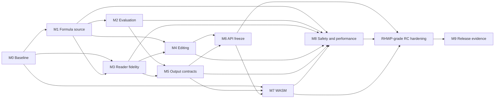

# rxls 0.1.2 → 1.0 Candidate Roadmap

> Ship `0.1.2` as one unusually large release whose behavior, compatibility,
> evidence, and operational safety are already close to a `1.0.0` candidate.

| Field | Value |
| --- | --- |
| Status | `0.1.2` published; `1.0.0` observation active |
| Target | `0.1.2` |
| Baseline date | 2026-07-15 |
| Original estimate | 30–45 solo development days, about eight weeks |
| Public-release policy | No intermediate crates.io release; integrate once into `0.1.2` |
| Next public version | A low-change `1.0.0` after a 2–4 week observation period |

## 1. Goal

`0.1.2` must satisfy all of these conditions:

- `.xls`, `.xlsx`, `.xlsb`, and `.ods` readers behave predictably on representative and hostile inputs.
- Formula source recovery and deterministic evaluation are tested independently from cached values.
- `.xlsx`/`.xlsm` editing preserves untouched package content and safely supports declared structural edits.
- XLSX authoring, CSV/HTML/Markdown export, CLI diagnostics, JSON, and WASM share the same semantics.
- Public Rust APIs, features, errors, CLI behavior, and JSON contracts are stable enough to carry into `1.0`.
- Corpus parity, fuzzing, security, resource, performance, package, and release evidence are reproducible.
- `0.1.3` is reserved for security, data-loss, broad compatibility, or release-asset defects.

“Nearly 1.0” means documented boundaries, explicit failure instead of silent wrong results, a credible compatibility promise, and reviewable evidence—not merely a large feature count.

## 2. Status and evidence rules

- `[x]` means the requirement is proven by current local, hosted, registry, or
  external-consumer evidence as appropriate to its scope.
- `[ ]` means either an implementation or evidence gap remains, or a stated
  observation interval has not elapsed.
- A configured workflow is local evidence that the gate exists; it is not evidence that the hosted gate passed.
- Checked-in corpus summaries are frozen metadata, not a substitute for rerunning the live 916-file corpus on the release commit.
- No milestone is release-complete while one of its completion criteria remains unchecked.

### Current release baseline

- Native and WASM release identities and lockfiles are synchronized and guarded by tests.
- Stable and Rust 1.85 native/WASM locked builds have local evidence.
- Formula source, deterministic evaluation, reader fidelity, output contracts, WASM packaging, and resource controls have focused local tests.
- The checked-in public baseline records 916 eligible files: 869 opens, 47 expected rejections, 0 unexpected failures, and 0 unexpected accepts.
- The latest local run reproduces that complete 916-file baseline and all four parity thresholds.
- Node and a real Chromium-family browser pass WASM smoke tests and normalized native-report parity locally.
- LibreOffice independently opens/saves authored and package-edited `.xlsx` candidates without repair or rxls diagnostic warnings. The package-edited `.xlsm` candidate retains VBA and emits only the expected `MacrosPresentNotExecuted` warning. The deterministic medium/edit/large performance budgets pass locally.
- All four local and hosted tag-candidate release-style fuzz campaigns complete
  for 121 seconds without a crash, hang, timeout, OOM, or sanitizer finding.
- The crate is byte-reproducible across two clean package invocations, its registry dry-run passes, and the assembled local evidence bundle passes public-hygiene and checksum verification.
- The canonical local gate passes 651 library, 2 binary, 3 API-contract, 45 CLI, 149 integration, 6 rustdoc, and 150 Python tests.
- Exact-SHA CI and CodeQL, two clean release-candidate runs, the tag publication
  workflow, the 47-file GitHub Release, crates.io publication, docs.rs, and
  post-publication native/WASM consumer smokes passed for `0.1.2`. Only the
  explicitly listed 2–4 week `1.0.0` observation criteria remain open.

## 3. Release strategy and change control

### 3.1 Minimal public releases

- Do not publish alpha, beta, or RC crates.
- Produce numbered internal candidates only as CI artifacts.
- Tag one fully qualified commit as `v0.1.2`.
- Observe `0.1.2` for at least two weeks, preferably four.
- Prepare `1.0.0` without feature churn if no unresolved P0/P1 issue appears.
- Permit `0.1.3` only for security, data loss, broad open failures, or defective release assets.

### 3.2 Merge rules

- Close work with code, regression tests, documentation, and evidence output together.
- Return an explicit error or typed cached/unsupported reason instead of a silent wrong value.
- Record public API changes and migrations in `CHANGELOG.md` before the M6 freeze.
- After M6, prefer fixes; do not remove or rename public APIs without explicit approval.
- Defer features that materially expand the release schedule or validation surface.

## 4. Support boundary

### 4.1 Guaranteed for `0.1.2`

- Predictable cell values, formula source, merges, and common metadata for supported formats.
- Practical XLSX/XLSM reading, authoring, package-preserving editing, and declared structural edits.
- A clear boundary between deterministic evaluation and typed fallback.
- Deterministic XLSX, CSV, HTML, Markdown, CLI, JSON, native, and WASM behavior.
- Bounded, diagnosable failure for corrupt or amplification-oriented inputs.

### 4.2 Explicitly out of scope

- Pixel-perfect Excel styling or every custom number format.
- VBA execution or pivot-table calculation semantics.
- New `.xls`, `.xlsb`, or `.ods` writers.
- Encryption beyond the documented supported subset.
- Excel-complete dynamic arrays, external-workbook calculation, or volatile-function evaluation.

Unsupported content should remain readable or preservable where safe, with an explicit reason when it cannot be evaluated or edited.

## 5. Milestones

### M0. Repository, CI, and release baseline

**Original estimate:** 1–2 days. **Depends on:** nothing.

**Purpose:** make every later result reproducible and attributable.

#### Work

- [x] Synchronize native/WASM package versions, lockfiles, and release-identity checks.
- [x] Define stable/MSRV and native/WASM locked-build jobs.
- [x] Emit fetch/input hashes, the consumed manifest SHA-256, oracle reader versions, worst cases, and skip reasons in parity evidence.
- [x] Replace conflicting README/workflow corpus counts with one checked-in baseline contract.
- [x] Record corpus sources, licenses, expectations, and hashes in deterministic metadata.
- [x] Define release-asset names, checksums, diagnostics, and evidence-bundle structure.
- [x] Upload diagnostics even when parity/fuzz/release stages fail.
- [x] Commit and reproduce identical small-parity results for the candidate SHA in GitHub Actions. **External**

#### Completion criteria

- [x] Stable/MSRV native and WASM locked builds pass locally.
- [x] Local tests validate generated README/baseline consistency.
- [x] The same commit produces identical small-parity results locally and in GitHub Actions. **External**
- [x] The hosted release workflow reaches the full-corpus stage and retains failure evidence. **External**

### M1. BIFF/XLSB formula-source fidelity

**Original estimate:** 5–8 days. **Depends on:** M0.

**Purpose:** remove formula-source errors that cached results can hide.

#### Work

- [x] Generate and audit the official Ftab function ID/name/arity table, including `ABS`, `TRUE`, `FALSE`, and `NOW`.
- [x] Handle BIFF5, BIFF8, and BIFF12 token-layout differences through explicit contexts.
- [x] Preserve relative/absolute markers for refs and areas (`$A$1`, `A$1`, `$A1`).
- [x] Resolve 3-D sheet names and sheet ranges for BIFF and XLSB.
- [x] Resolve workbook/sheet defined names and preserve unresolved external `NameX` references diagnostically.
- [x] Resolve retained external-name tables to their original `NameX` names while preserving external-workbook provenance.
- [x] Implement `PtgAttr`, arrays, intersection/union/range, `RefN`, and `AreaN` handling.
- [x] Reconstruct shared and array formulas from `PtgExp` anchors in BIFF and XLSB.
- [x] Preserve unsupported or malformed tokens as explicit diagnostics rather than empty formula text.
- [x] Add independent BIFF5/8/12 token oracles and real-file formula-source fixtures.
- [x] Keep formula-source assertions independent from cached-value assertions.

#### Completion criteria

- [x] The official assigned-function audit reports no missing or historically mismapped ID.
- [x] Local source regressions cover absolute/relative refs, 3-D refs, names, arrays, and shared formulas.
- [x] Supported tokens are not silently discarded; unresolved external names remain explicit.
- [x] Formula-source regressions compile and pass under the locally verified stable/MSRV matrix.
- [x] Real external `NameX` names are restored when an external-name table is present.

### M2. Deterministic formula evaluator

**Original estimate:** 4–7 days. **Depends on:** M1.

**Purpose:** freeze the boundary between computed results, cached fallback, errors, and unsupported semantics.

#### Work

- [x] Parse bare and dollar-qualified cell/range references.
- [x] Support whole-row (`3:5`) and whole-column (`B:D`) ranges under cell/operation budgets.
- [x] Resolve quoted sheets, sheet ranges, workbook names, and sheet-local names with cycle detection.
- [x] Normalize OpenFormula/ODS references into the common evaluator.
- [x] Lock coercion, blank, error, string/number, date-serial, and 1900/1904 behavior with tests.
- [x] Audit supported functions for arity, range flattening, and error propagation.
- [x] Return typed fallback reasons for volatile, external, array, circular, oversized, dependency-depth, operation-budget, or unsupported semantics.
- [x] Expose computed/error/cached/unsupported counts consistently in library reports, CLI, JSON, and WASM.
- [x] Bound expression and formula-dependency depth, range traversal cells, and per-evaluation semantic operation counts shared across referenced formulas.
- [x] Make repeated evaluation and diagnostics deterministic.

#### Completion criteria

- [x] Declared reference and function semantics pass focused local regressions.
- [x] Unsupported semantics cannot silently become a computed value.
- [x] Evaluation/cache/unsupported distributions are emitted for release evidence.
- [x] Formula-source fixtures feed the evaluator with expected computed or typed-fallback results.

### M3. Reader fidelity and real-document compatibility

**Original estimate:** 5–8 days. **Depends on:** M0 and M1.

**Purpose:** move beyond synthetic cell-only fixtures without hiding format-specific loss.

#### Work

- [x] Add a licensed, tracked Korean CP949 BIFF5 derivative with exact text and metadata oracles.
- [x] Add golden CP949/EUC-KR, Shift-JIS/CP932, and Windows-1252 decoding coverage.
- [x] Document missing, unknown, incorrect, and malformed-codepage behavior and the explicit override.
- [x] Preserve supported rich-text run boundaries and document inherited/lost style identity by format.
- [x] Read the supported XLSX/XLSM number-format, font, fill, border, alignment, and protection subset.
- [x] Define the safe common-style subset and explicit XLS/XLSB/ODS loss boundaries.
- [x] Audit merges, visibility, active sheet, tab color, row/column state, views, and layout metadata across formats.
- [x] Document names, non-worksheet sheet types, comments, hyperlinks, tables, and validations in a reader matrix.
- [x] Return typed encryption, compression, container, BIFF, and XML failures without panic.
- [x] Cover multilingual, RTL, emoji, combining-character, long-text, and hostile-repeat cases.

#### Completion criteria

- [x] The CP949 BIFF5 README item and fixture oracle are closed.
- [x] Supported codepage golden comparisons pass locally.
- [x] `docs/READER_FIDELITY.md` records per-format support and loss boundaries.
- [x] Focused negative and hostile-input tests terminate within local resource budgets.

### M4. XLSX/XLSM editing API

**Original estimate:** 5–8 days. **Depends on:** M1 and M3.

**Purpose:** provide practical edits without damaging unrelated package content.

#### Work

- [x] Rename sheets atomically and rewrite formulas, names, print references, charts, internal links, and other retained sheet-qualified references.
- [x] Add/delete worksheets with deterministic IDs/parts, minimum/visible-sheet rules, active-tab handling, and local-name index repair.
- [x] Add legacy-note and single-cell hyperlink create/update/delete editing APIs, with threaded comments and ambiguous range relationships explicitly rejected.
- [x] Complete merge/unmerge editing and overlap validation as a frozen public contract.
- [x] Complete exact-range data-validation editing and safe existing-table bottom-row resizing; table creation/deletion and header/width moves remain excluded.
- [x] Freeze row/column sizing and hidden state, frozen panes, and local print-area editing as the supported layout subset.
- [x] Cross-validate document properties, global names, visibility, active sheet, and tab-color edits.
- [x] Provide clone-and-swap batch transactions with pre-commit serialization/validation and rollback.
- [x] Provide and document a filesystem sibling-temp-file plus atomic-rename persistence helper.
- [x] Explicitly exclude row/column insertion and deletion because no safe general dependency-repair contract is declared for `0.1.2`.
- [x] Verify untouched VBA, image, chart, pivot, signature-adjacent, custom XML, and unknown relationship parts remain preserved where declared.
- [x] Preserve macro-enabled content types, extension semantics, and VBA payloads.
- [x] Keep part allocation, ZIP ordering, and supported serialization deterministic.
- [x] Close the invalid-value/name/timestamp validation gaps and freeze every supported operation, atomicity tier, preservation rule, rejection case, and structural exclusion in `EDITING-CONTRACT.md`.

#### Completion criteria

- [x] Implemented transaction, rename, add/delete, and preservation paths pass open/edit/save/reopen tests.
- [x] Unedited important package parts retain byte or semantic hashes in focused tests.
- [x] Authored and package-edited `.xlsx` files pass a LibreOffice no-repair open/save/reopen smoke locally.
- [x] A package-edited `.xlsm` file passes the same independent LibreOffice smoke with VBA retained and only the expected `MacrosPresentNotExecuted` diagnostic warning.
- [x] Invalid editable values, defined names, and timestamps are rejected without silent normalization or deletion.
- [x] Failed transactions leave the exact pre-transaction package unchanged.
- [x] All declared structural edits have formula/name/table/validation/merge reference regressions; excluded row/column insertion/deletion is not part of this criterion.

### M5. Writer, export, CLI, and report contracts

**Original estimate:** 3–5 days. **Depends on:** M2 and M3.

**Purpose:** turn user-visible output into long-lived compatibility contracts.

#### Work

- [x] Validate authored XLSX structure and semantics with openpyxl.
- [x] Run LibreOffice headless open/save smoke for authored and edited workbooks.
- [x] Round-trip numbers, strings, booleans, dates, errors, formulas, blanks, styles, metadata, and Unicode.
- [x] Return typed failures for Excel grid/string limits and bounded writer/export payloads.
- [x] Make XLSX, CSV, HTML, Markdown, and diagnose JSON output deterministic.
- [x] Add CSV delimiter/newline/BOM/output-limit and formula-injection policy.
- [x] Lock HTML and Markdown escaping regressions.
- [x] Freeze diagnose JSON schema v1 with an exact golden file and evolution policy.
- [x] Freeze CLI stdout/stderr, help/version, exit classes, and bounded-output behavior.
- [x] Reuse the same core report structure in library, CLI, native byte adapters, and WASM.
- [x] Document small-file, bounded-output, row-iteration, and non-streaming guidance.

#### Completion criteria

- [x] The supported writer opens in an independent consumer and retains tested values/formulas/metadata.
- [x] CLI exit-code and JSON-schema golden tests pass locally.
- [x] Export injection and escaping regressions pass locally.
- [x] `OUTPUT-CONTRACTS.md` defines future change rules.
- [x] The available local LibreOffice runtime smoke passes; the release workflow repeats it on the hosted runner.

### M6. Rust API freeze and 1.0 compatibility design

**Original estimate:** 4–6 days. **Depends on:** public model decisions from M1–M5.

**Purpose:** make the expected `0.1.2 → 1.0.0` breaking delta zero.

#### Work

- [x] Inventory public root types, major method surfaces, aliases, features, and classifications in `API-COMPATIBILITY.md`.
- [x] Freeze zero-based coordinates, inclusive ranges, and row/column types.
- [x] Document `Option`, `Result`, warning, partial-read, and unsupported-result policy.
- [x] Mark extensible public errors/results/options with `#[non_exhaustive]` where verified.
- [x] Preserve error source chains and document compatible error evolution.
- [x] Define alias/deprecation policy; no current public item is planned for removal or rename.
- [x] Document ownership, borrowing, full-buffer copies, and row-iteration guidance.
- [x] Add compile-time Send/Sync, error, and unwind-safety contract tests.
- [x] Document additive feature semantics and the default/no-default/full/all-feature matrix.
- [x] Freeze MSRV at Rust 1.85 in manifests and CI configuration.
- [x] Audit public dependency exposure and visible major-version boundaries.
- [x] Add a compile-checked create/read/inspect/evaluate/export/diagnose/edit/reopen journey.
- [x] Finish a machine-enforced `Errors`/`Panics`/`Examples` rustdoc audit for the declared ten-entry principal API inventory; cover every other public signature with warning-free rustdoc and the API snapshot.
- [x] Record the planned `1.0.0` breaking-change list as empty.

#### Completion criteria

- [x] The checked-in public API inventory has no unclassified listed area.
- [x] Generate and check a machine-readable semver/API-diff baseline.
- [x] Compile every documented journey and supported feature combination in hosted CI. **External**
- [x] The current compatibility design lists zero expected `1.0.0` breaking changes.

### M7. WASM runtime and distribution

**Original estimate:** 2–4 days. **Depends on:** M0, M5, and M6.

**Purpose:** promote the byte adapter into a tested distributable target.

#### Work

- [x] Synchronize WASM versions/lockfiles and add recurrence checks.
- [x] Build `wasm32-unknown-unknown` locked artifacts under stable and Rust 1.85 locally.
- [x] Validate pinned `wasm-bindgen` output, TypeScript declarations, and npm metadata.
- [x] Read and diagnose a tracked fixture in Node and a real browser.
- [x] Throw stable JavaScript `Error` objects carrying Rust kind, message, location, and cause.
- [x] Set a 32 MiB synchronous input limit and document copy, peak-memory, worker, and streaming guidance.
- [x] Compare parsed native CLI, Node WASM, and browser WASM diagnose JSON.
- [x] Record raw WASM, JavaScript glue, and compressed npm budgets and checksums.
- [x] Provide a minimal HTML/JS demo and TypeScript usage examples.

#### Completion criteria

- [x] Local Node/browser smoke and native parity pass.
- [x] Local stable/MSRV locked WASM builds pass.
- [x] The tagged GitHub Release contains the npm/WASM archive, size report, and checksum, and the downloaded archive installs through Node package resolution and executes in Node and a real browser. **External**
- [x] Exact-limit and over-limit Node probes terminate without OOM, hang, or panic.

### M8. Security, fuzzing, performance, and resource limits

**Original estimate:** 3–5 days. **Depends on:** stable input paths from M1–M7.

**Purpose:** bound operational risk for a 1.0 candidate.

#### Work

- [x] Cover reader dispatch, authoring, package editing, formula decompilation, and evaluation with fuzz targets.
- [x] Configure bounded PR fuzz smoke and longer scheduled/manual campaigns with retained logs/artifacts.
- [x] Add ZIP/package, XML/entity/depth/node, text/image, dimensions, ODF repeat, and writer amplification controls.
- [x] Bound formula depth, cycles, ranges, token work, and per-evaluation semantic operations shared across referenced formulas.
- [x] Separate timeout/RSS/crash diagnostics in fuzz configuration and retain reproducer artifacts.
- [x] Configure CodeQL plus Rust security/license/source policy in release gates.
- [x] Add deterministic performance evidence tooling and a locally verified small-fixture budget.
- [x] Generate a deterministic medium OOXML fixture and measure release-mode diagnose and package-edit/save workloads.
- [x] Record release-runner medium/large corpus and package-edit peak RSS/time/output baselines. **External**
- [x] Define separate native and WASM memory/bundle budgets.
- [x] Document absolute performance regression budgets and separate same-SHA reproducibility/noise limits in `PERFORMANCE.md`.
- [x] Enforce same-SHA performance/RSS/output reproducibility comparisons against the first candidate run and fail closed on missing or malformed evidence.

#### Completion criteria

- [x] Every fuzz target completes the 120-second tag-candidate campaign with zero unclassified crash. **External**
- [x] Focused hostile fixtures terminate inside declared local budgets.
- [x] Hosted CodeQL/cargo-deny reports zero high/critical security and blocking license issues. **External**
- [x] Release-runner measurements pass every absolute performance and memory budget. **External**
- [x] Hosted same-SHA performance/RSS/output reproducibility evidence is present and passes for the tag candidate. **External**

### M9. Full corpus, documentation, and release evidence

**Original estimate:** 2–3 days. **Depends on:** M0–M8.

**Purpose:** make the single public-release decision from reproducible evidence.

#### Work

- [x] Check in the 916-file baseline schema, source expectations, rejection taxonomy, and parity summary metadata.
- [x] Re-fetch and verify all 916 files on the final local candidate: 869 opens, 47 expected rejections, and zero unexpected results.
- [x] Configure combined corpus/parity reports with hashes, worst cases, skips, and baseline verification.
- [x] Generate final formula-source, evaluation/fallback, and edit-preservation evidence tables.
- [x] Validate README corpus numbers against the checked-in evidence contract.
- [x] Complete the final README, rustdoc, CLI help, changelog, migration, and support-matrix audit.
- [x] Verify final crate contents, license/notices, repository metadata, and documentation links.
- [x] Confirm that no native binary artifacts are promised for `0.1.2`; this release distributes the crate and an npm-compatible WASM archive through GitHub Releases.
- [x] Generate a local npm-compatible WASM candidate archive, size evidence, and checksum; wire them into GitHub release assets.
- [x] Generate a deterministic CycloneDX SBOM and wire it into release evidence.
- [x] Add a fail-closed two-candidate comparator that verifies manifest coverage and explains every permitted timing/RSS/edit-output/fuzz checksum difference.
- [x] Make the tag-publication path require a successful exact-SHA comparison artifact and immutable candidate attestation.
- [x] Run the clean release workflow twice against the same commit and explain every checksum difference. **External**
- [x] Create the `v0.1.2` tag and GitHub Release and perform Go/No-Go. **External**
- [x] Publish to crates.io, attach the WASM archive to GitHub Releases, then smoke crate installation, downloaded-WASM Node package resolution and real-browser execution, docs.rs, assets, and checksums. **External**

#### Completion criteria

- [x] The local full-corpus run has zero unexpected open failure and zero unexpected accept; the tag workflow repeats it.
- [x] Every release gate is green for the tag commit. **External**
- [x] Two clean release-candidate runs are reproducible. **External**
- [x] GitHub Release contains every promised artifact and checksum. **External**
- [x] README, changelog, support matrix, and generated evidence agree on the final tag. **External**

### Release-candidate hardening — RHWP-grade product spine

This bounded pre-publication pass adopts the product qualities demonstrated by
`rhwp` v0.7.18 without importing HWP-specific rendering, app, extension,
binding, or internal-log scope. The current public roadmap and its API,
editing, output, fidelity, performance, and migration contracts are
authoritative; obsolete internal June/early-July planning assertions are not.

- [x] Pin every third-party workflow dependency to an immutable commit and
  enforce that rule with a repository policy test.
- [x] Build meaningful fuzz corpora deterministically from tracked fixtures,
  replay every seed, and retain counts and hashes in candidate evidence.
- [x] Verify all declared spreadsheet formats and WASM exports through the
  packed npm artifact, CommonJS, ESM/browser resolution, TypeScript, native
  parity, and the shipped browser demo.
- [x] Verify the exact packaged crate as an external library and installed CLI;
  smoke version, stdout help, diagnostics, and failure behavior.
- [x] Run lightweight Linux, macOS, and Windows installed-product coverage in
  hosted CI while retaining the complete Linux release gate.
- [x] Keep capability regressions anchored in committed tests, including
  `committed_xls_fixture_exposes_legacy_reader_surface`,
  `committed_xlsx_fixture_exposes_structural_reader_surface`,
  `committed_xlsb_fixture_exposes_binary_reader_surface`,
  `committed_ods_fixture_exposes_repeat_merge_hyperlink_surface`, and
  `editable_xlsm_noop_save_preserves_vba_project`.
- [x] Keep native FFI, speculative editor/UI expansion, browser extensions,
  native binary archives, and new spreadsheet semantics outside the 0.1.2
  completion boundary.

## 6. Dependency and execution order

| Phase | Primary work | Deliverable |
| --- | --- | --- |
| 1 | M0 | Reproducible CI/WASM identity |
| 2 | M1 + M3 | Formula-source and reader-fidelity evidence |
| 3 | M2 + M4 | Evaluation semantics and safe structural editing |
| 4 | M5 + M6 + M7 | Frozen outputs/API and distributable WASM |
| 5 | M8 | Fuzz, security, performance, and resource evidence |
| 6 | RHWP-grade RC hardening | Immutable automation, seeded fuzz, real package/browser, and installed-product proof |
| 7 | M9 | Two clean candidates, final Go/No-Go, and `v0.1.2` |

## 7. Progress tracking

| Milestone | Status | Approx. completion | Remaining blocker |
| --- | --- | ---: | --- |
| M0 Baseline | Done | 100% | None |
| M1 Formula source | Done | 100% | None |
| M2 Evaluator | Done | 100% | Release evidence is collected in M9 |
| M3 Reader fidelity | Done | 100% | None |
| M4 Editing | Done | 100% | None |
| M5 Output contracts | Done | 100% | None |
| M6 API freeze | Done | 100% | None |
| M7 WASM | Done | 100% | None |
| M8 Safety/performance | Done | 100% | None |
| RHWP-grade RC hardening | Done | 100% | None |
| M9 Release evidence | Done | 100% | None |

Status values are `Pending`, `Next`, `In progress`, `Blocked`, and `Done`. Completion criteria, not checkbox count, determine status.

## 8. Go/No-Go checklist

Any unchecked item is a release No-Go.

### Correctness

- [x] Official Ftab and core Ptg source regressions pass locally.
- [x] Computed, cached, unsupported, and error outcomes are distinct locally.
- [x] The local full corpus has zero unexpected result; the release workflow repeats it on the tag commit.
- [x] Checked-in README, workflow expectations, and baseline metadata agree.

### Compatibility

- [x] Representative local `.xls`, `.xlsx`, `.xlsb`, and `.ods` fixtures pass.
- [x] Authored and edited XLSX files pass independent LibreOffice no-repair smoke locally.
- [x] An edited XLSM file passes independent LibreOffice no-repair smoke with VBA retained and only the expected `MacrosPresentNotExecuted` diagnostic warning.
- [x] Focused tests preserve untouched important package content.
- [x] Native/CLI/Node/browser normalized diagnostics agree locally.

### API and documentation

- [x] The public API inventory targets zero `1.0` breaking changes.
- [x] Local MSRV/default/no-default/all-feature gates pass.
- [x] The principal API journey compiles and runs locally.
- [x] Support, loss, fallback, output, and resource boundaries are documented.
- [x] Machine-readable API diff and final rustdoc audit pass locally.

### Security and operations

- [x] Required hosted fuzz duration completes with no unclassified crash/hang/OOM. **External**
- [x] Hosted security/license gates report no blocker. **External**
- [x] Release-runner performance/memory evidence passes every absolute budget. **External**
- [x] Hosted same-SHA performance/RSS/output reproducibility evidence passes for the candidate. **External**
- [x] Focused hostile and boundary tests terminate within local budgets.
- [x] The clean release workflow succeeds twice. **External**

### Distribution

- [x] Local crate/package and npm/WASM candidate inspections pass.
- [x] GitHub Release assets, evidence, SBOM, npm-compatible WASM archive, and checksums exist. **External**
- [x] Tag, crate, docs.rs, and assets point to the same commit. **External**
- [x] Post-publication crate install plus downloaded-WASM Node and browser install/execute smokes pass. **External**

## 9. Defect priority and release blocking

| Priority | Examples | `0.1.2` rule |
| --- | --- | --- |
| P0 | Data loss, code execution, infinite loop, broad corruption | Must fix; restart RC count |
| P1 | Wrong formula, representative open failure, XLSM loss, unusable WASM | Must fix |
| P2 | Rare metadata loss, explicit unsupported gap, documentation defect | Fix if promised; otherwise approve and document exclusion |
| P3 | Convenience, minor performance, output preference | Defer |

During RC, accept only P0/P1 fixes and their direct regressions. A P2 fix must be narrow and must not disturb the API freeze.

## 10. Transition from `0.1.2` to `1.0.0`

### Observation period

- Duration: minimum two weeks, preferably four.
- Collect: real-file failures, panic/timeout, wrong formulas, edit preservation, WASM installation, and API confusion.
- Triage repeated reports by root cause, severity, and whether they fall inside the declared support boundary.

### Allowed follow-up changes

- Documentation and examples.
- Clearer errors without contract changes.
- Semantics-preserving performance improvements.
- Internal refactoring and regression tests.
- Emergency security, data-loss, or compatibility fixes.

### `1.0.0` criteria

- [ ] No unresolved P0/P1 remains after the observation period.
- [ ] No `0.1.2` public API is removed or breaking-renamed.
- [ ] Support, SemVer, and MSRV policies are final.
- [ ] The `0.1.2` release gates pass again at equal or stronger thresholds.
- [ ] Migration documentation can state that no required code change is expected.

## 11. Decision record

| Date | Decision | Reason |
| --- | --- | --- |
| 2026-07-15 | Integrate without intermediate public releases | Minimize user update burden and release fragmentation |
| 2026-07-15 | Treat `0.1.2` as a practical 1.0 candidate | Minimize later feature/API delta |
| 2026-07-15 | Test formula source independently from cached results | Cached values can hide decompiler defects |
| 2026-07-15 | Require untouched-part preservation for editing | Prevent XLSX/XLSM collateral data loss |
| 2026-07-15 | Keep writer scope at XLSX | Avoid unbounded schedule and validation growth |
| 2026-07-15 | Use CI artifacts for internal candidates | Test distributables without publishing extra versions |
| 2026-07-15 | Separate local evidence from hosted/publish evidence | Prevent configured workflows or frozen metadata from being mistaken for completed release gates |
| 2026-07-15 | Exclude row/column insertion and deletion from `0.1.2` | Safe general dependency repair is not yet a supportable contract |
| 2026-07-15 | Bundle a 120-second campaign for every fuzz target in the release workflow | Make tag-candidate fuzz evidence attributable and publishable with the other release evidence |
| 2026-07-15 | Complete the bounded RHWP-grade product spine before publishing 0.1.2 | Close automation, fuzz, package/browser, and installed-product evidence without copying format-specific product sprawl |
| 2026-07-15 | Treat this roadmap and the current public contracts as authoritative | The older internal PRD/TRD/ledger describe superseded MSRV, workflow, WASM, and capability states |

Record any scope change here with its alternative and schedule impact.

## 12. Definition of done

The roadmap is complete only when all are true:

- [x] Every M0–M9 task, completion criterion, and RHWP-grade RC-hardening item is closed.
- [x] Every Go/No-Go item is checked.
- [x] Corpus, formula, evaluation, editing, WASM, security, performance, and package evidence are assembled locally and wired into one hosted release bundle.
- [x] Two clean candidates for the same tag commit succeed consecutively.
- [x] `v0.1.2`, the crate, GitHub Release, documentation, SBOM, and checksums are public and consistent.
- [x] Post-publication crate and downloaded-WASM Node/browser install/core smokes pass.
- [x] Only observation/stabilization remains before `1.0.0`, with no required breaking change.

Test volume, a few successful samples, or a local-only pass never substitutes for this definition.
